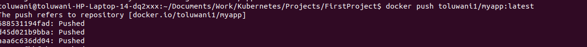
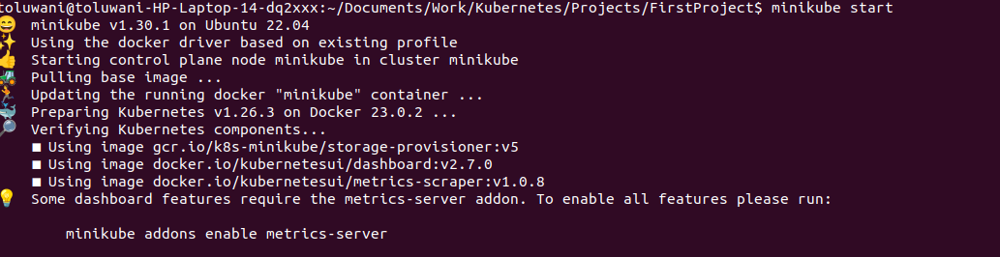

# Step by step way of Deploying simple js script on kubernetes

## Creating deployment and service file using minikube
1. Build and run your Docker Image

	`docker build -t my-app . ` 

    `docker run -p 3000:3000 my-app `

2. Push your docker image to your docker hub after logging in to your hub.
- You have to create a repository. Then you push to it.

` docker push <dockerhub-username>/<image-name>:<tag>`

3. Start Minikube using the minikube start command.

> `minikube start`

3. 